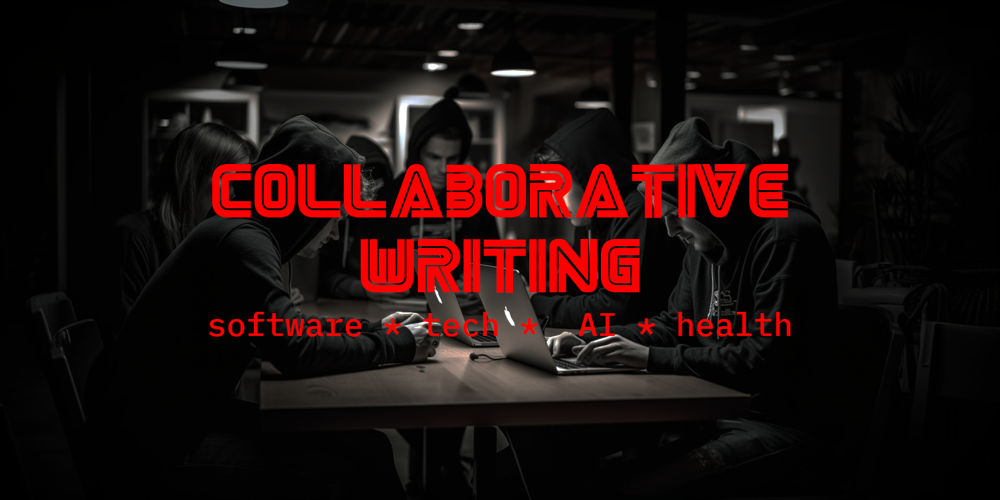

# Collaborative Writing With Friends



This repository serves as our collaborative space for drafting, reviewing, and publishing articles.

## Table of Contents

- [Topics Covered](#topics-covered)
- [How to Contribute](#how-to-contribute)
- [Directory Structure](#directory-structure)
- [Feedback & Suggestions](#feedback--suggestions)
- [License](#license)

## Topics Covered

- Modern Software Engineering
- Web Frameworks, Libraries, & Technologies
- AI Tools - ChatGPT, Midjourney, Claude, GitHub Copilot
- Health & Fitness
- [more to come]

## How to Contribute

1. **Clone the Repository**:
   ```
   git clone https://github.com/fromOkayToGreat/collaborative-writing.git
   ```
2. **Create a New Branch**:
   ```
   git checkout -b [branch-name]
   ```
3. **Make Your Changes**: Add or edit your article.
4. **Commit and Push**:
   ```
   git add .
   git commit -m "Your meaningful commit message"
   git push origin [branch-name]
   ```
5. **Open a Pull Request**: Go to the repository and open a new pull request. Briefly describe your changes and mention someone for a review.

## Directory Structure

- `drafts/`: Articles in progress.
- `published/`: Finalized articles ready for the audience.
- `images/`: Graphics, charts, and other visual content.

## Feedback & Suggestions

We welcome feedback and suggestions! If you have an article idea or a topic you'd like us to explore, please [open a new issue](repository-link/issues) in this repository.

## License

This work is licensed under the Creative Commons Attribution 4.0 International License. You are free to share and adapt, but please provide appropriate credit.
