# Improve Your Life With ChatGPT: A User-Friendly Guide

Welcome to "Improve Your Life With ChatGPT". In this course, you'll discover how to harness the power of ChatGPT not only to enhance your own life but also to inspire and benefit others.

This course is tailored for beginners, especially non-technical adults with a fundamental grasp of computers and basic internet skills.

The course is broken down into 5 sections. Each section has a short video and a short quiz.

# Table of Contents

1. [Introduction](#1-introduction)
   - [What is ChatGPT?](#what-is-chatgpt), [Getting Started](#getting-started), [ChatGPT Versions](#chatgpt-versions)
2. [How To Use ChatGPT](#2-how-to-use-chatgpt)
   - [ChatGPT User Interface](#chatgpt-user-interface), [Keyboard Shortcuts](#keyboard-shortcuts), [Let's get started with a prompt!](#lets-get-started-with-a-prompt), [Advanced Prompting](#advanced-prompting), [One-Shot and Few-Shot Learning](#one-shot-and-few-shot-learning)
3. [Interactive Workshop](#3-interactive-workshop)
   - [Creative Art](#creative-art), [Journaling](#journaling), [Learning](#learning), [Ideation](#ideation)
4. [Hallucinations, Math, Policies, Bias, and Economic Impacts](#4-hallucinations-math-policies-bias-and-economic-impacts)
   - [AI Hallucinations](#ai-hallucinations), [Mathematical Capabilities](#mathematical-capabilities), [Usage Policies](#privacy), [Bias & Discrimination](#bias--discrimination), [Economic Impacts](#economic-impacts)
5. [Conclusion & Call to Action](#5-conclusion--call-to-action)
   - [Final Conclusion](#final-conclusion), [Key Takeaways](#key-takeaways), [Improve Your Life](#improve-your-life), [Call to Action](#call-to-action)

## Before We Begin

- Create a free account on [chat.openai.com](https://chat.openai.com/) to start using ChatGPT.
- For on-the-go access to ChatGPT, consider downloading the app for iOS or Android.

## 1. Introduction

Imagine arranging a dinner date with a friend. You send a quick text, and they promptly reply with a proposed time. A few exchanged emojis later, your evening plans are set.

In an age where digital communication feels almost as natural as face-to-face conversation, we are continually seeking ways to make our interactions with technology more intuitive and efficient.

### What is ChatGPT?

ChatGPT is a step towards humans communicating with computers as they would with other humans. ChatGPT is a chat application designed with Artificial Intelligence (AI) for generating human-like text based on given prompts. It's a user-friendly assistant that can help you with a variety of tasks, from answering questions, assisting with writing, tutoring in various subjects, brainstorming, and more.

You could technically 'speak' to ChatGPT. However, for it to work, your spoken words must be transformed into text. That's because ChatGPT is an AI chat application built on an advanced AI model known as the "Generative Pre-trained Transformer" or GPT. ChatGPT is a shining example of Large Language Models (LLMs). These LLMs undergo training on vast troves of text data, ranging from books to internet content, including extensive resources like Wikipedia. This immense data training enables them to identify and understand the intricate patterns within human language. Specifically, it thrives in the realm of NLP (Natural Language Processing), aiming to grasp and reproduce the intricacies of natural human language.

NLP encompasses a broad range of tasks:

- **Text Classification** - Categorizing input text into predefined groups such as sentiment analysis and topic categorization.
- **Automatic Translation** - Translating text from one language to another without human intervention.
- **Question Answering** - Providing answers based on a given text.
- **Text Generation** - Generating coherent and relevant output text from a given input, known as a prompt.

At its core, ChatGPT is a prediction engine, crafting responses based on the myriad patterns it has observed in its vast training data.

To grasp ChatGPT's capabilities, we first need to define some foundational concepts:

- **Artificial Intelligence (AI)**: Any technique that enables computers to mimic human behavior.
- **Machine Learning (ML)**: A branch of Artificial Intelligence where computers learn from data. Instead of being explicitly programmed to perform a task, they use algorithms and statistical models to predict or decide based on the data they're given.
- **Deep Learning (DL)**: A specialized area within Machine Learning that uses neural networks, inspired by the human brain, to process and interpret complex data. These networks can automatically learn and improve from experience, making them particularly effective for tasks like image and speech recognition.
- **Neural Networks (NN)**: Inspired by the structure and function of the human brain, a neural network is a computational model designed to process information. It learns and identifies patterns from data, enabling it to make predictions or decisions after sufficient training.

Now that you have an overview of what ChatGPT is, let's explore how to get started with it.

### Getting Started

You can access ChatGPT for free at [chat.openai.com](https://chat.openai.com/).

- An account is required.
- Usage is throttled.
- Conversations are not private by default.

For enhanced features, ChatGPT Plus is available at $20/month:

- Priority access.
- Increased usage limits.
- Private conversations.
- Access to new features.
- Availability of GPT-4.

### ChatGPT Versions

- **ChatGPT-4** - OpenAI’s most advanced system, producing safer and more useful responses. It can solve difficult problems with greater accuracy, thanks to its broader general knowledge and problem-solving abilities. Exclusively available to ChatGPT Plus users.
- **ChatGPT-3.5** - A chatbot launched by OpenAI and built on the GPT-3.5 family of large language models. It's fine-tuned with supervised and reinforcement learning techniques. It can answer everyday questions, admit wrong replies, and reject inappropriate requests. Available to all users.

### Quiz 1 - Introduction to ChatGPT

1. What is ChatGPT primarily designed for?

- A) Cooking recipes
- B) Human-like text generation
- C) Gaming
- D) Weather prediction

2. Which term is used to describe a computational model designed to process information and learn patterns from data, inspired by the human brain?

- A) Machine Learning
- B) Natural Language Processing
- C) Neural Network
- D) Artificial Intelligence

3. Deep Learning is a specialized area within:

- A) Neural Networks
- B) ChatGPT
- C) Machine Learning
- D) Text Generation

4. True or False: ChatGPT can translate spoken words directly without transforming them into text.

5. What does NLP encompass? (Choose all that apply)

- A) Text Classification
- B) Automatic Translation
- C) Image Recognition
- D) Question Answering
- E) Text Generation

6. Which of the following are features of ChatGPT Plus?

- A) Free access
- B) Priority access
- C) Lower usage limits
- D) Public conversations only

7. What is Artificial Intelligence (AI)?

- A) A specialized area within Machine Learning
- B) Any technique that enables computers to mimic human behavior
- C) The process of translating text from one language to another
- D) A specific version of ChatGPT

8. True or False: ChatGPT-4 is available to all users, including those without a subscription.

### Answers

1. B
2. C
3. C
4. False
5. A, B, D, E
6. B
7. B
8. False

## 2. How To Use ChatGPT

At its core, ChatGPT is designed to be a user-friendly assistant. For general use, you simply engage in a conversation with it, much like texting a friend. You can ask a question or present a topic and it will respond.

> "Never include sensitive personal, business, or customer data in your conversations with ChatGPT."

### ChatGPT User Interface

The user interface for ChatGPT generally involves a text-based interaction, much like a messaging app.

The interface is divided into two sections: the text box and the conversation history.

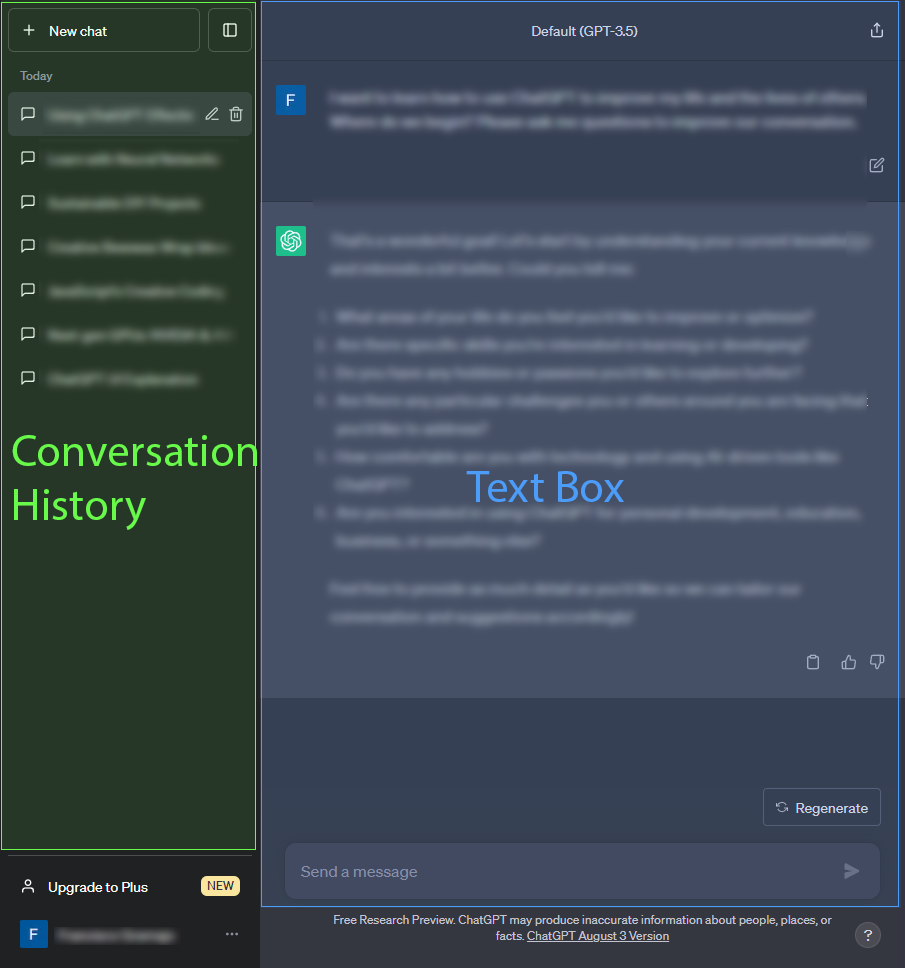

### Text Box

The text box is where you enter your prompt so a conversation can begin.

- You can edit your prompt at any time by clicking on the text box and typing in a new prompt.
- You are also able to like or dislike a response by clicking on the thumbs up or thumbs down icon next to the response. This will help ChatGPT learn what you like and dislike so it can provide better responses in the future.
- There is a copy icon next to the thumbs up and thumbs down icons that will copy the response to your clipboard.
- The regenarate icon will generate a new response that is different from the previous response.

### Conversation History

The conversation history is where you can see the conversation between you and ChatGPT. It's a great way to keep track of what you've said and what ChatGPT has said. You can also use it to review your conversation and make sure you're getting the best results.

- The ? icon on the bottom right of the conversation history that will open a help menu. The help menu will provide you with information about ChatGPT and keyboard shortcuts to maximize your efficiency.

Below are two examples of the ChatGPT user interface highlighting important sections of the interface and how they are used.

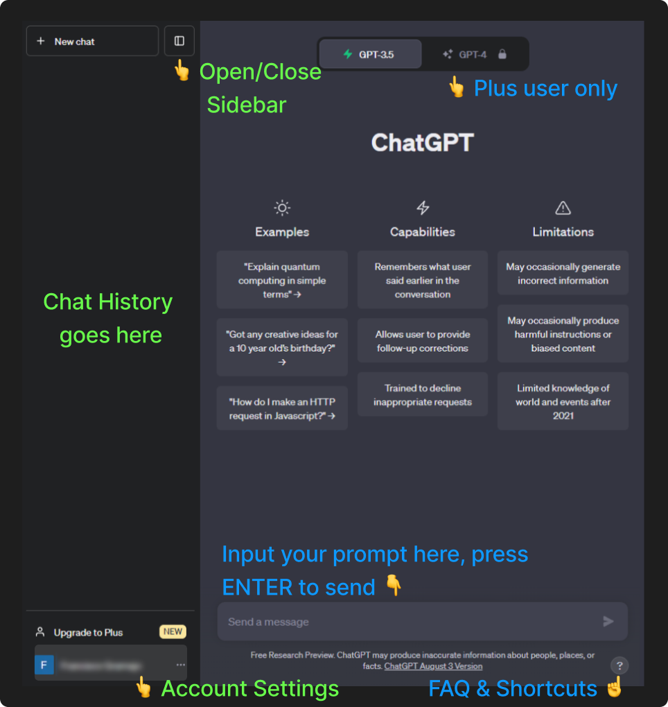

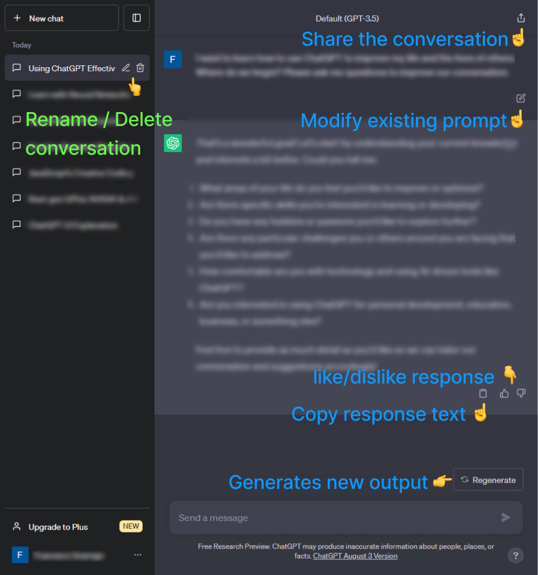

### Keyboard Shortcuts

ChatGPT has a few keyboard shortcuts. If you begin using them early, they will become second nature and you'll be able to use ChatGPT more efficiently.

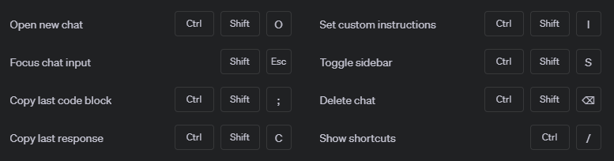

### Let's get started with a prompt!

> ChatGPT-3.5 will be used throughout the whole course.

A prompt is the text you enter into the text box to start a conversation with ChatGPT. Writing a good prompt helps us get the most out of AI tools like ChatGPT. Prompting is a way to give these AI models direction so it can understand our task and then help us complete it. But to get the best results, you need to know how to craft a good prompt. And most people who struggle with prompting are making the same mistake. They're being too generic and expecting that AI is just going to read our minds.

#### Example 1 - Simple Prompt

Let's begin with a simple prompt asking for life advice. "I want to improve my life"

As you can see in this response ChatGPT is a friendly assistant that gives general tips to improve your life. It's not perfect, but it's a good start. Let's try another prompt with a little more context.

#### Example 2 - More Context

Let's try a prompt that gives ChatGPT more context. "I want to improve my life by being more productive"

As we can see, with more context, ChatGPT has more information about the situation, allowing it to respond more specifically to our request. Sometimes we are not sure exactly what we want to ask ChatGPT. In these cases, we can ask ChatGPT to help us.

#### Example 3 - Ask me for context

Let's try a prompt that asks ChatGPT for help by having ChatGPT ask questions. "I want to improve my life by being more productive. Can you ask me questions about the context?"

As seen in the response, even ChatGPT recognizes that asking questions about your current context can help it understand and provide more personalized advice. Instead of asking it to do the task, we now instruct ChatGPT to ask questions about the context.

### Advanced Prompting

All three examples demonstrate why context is important. The more context you give it, the better it can respond to your request. Those are sure to get you started, but let's look at some more advanced prompting techniques. These techniques will transform your ChatGPT experience.

#### Prompt Length & Asking for Multiple Things

Now that you're getting better responses, you might be tempted to write a long prompt, asking for 4 or 5 things at once. But this is usually not a good idea, especially if you're using GPT-3.5. ChatGPT works best when you give it one specific thing to focus on at a time, this specific thing can be complex but be sure to stay away from giving it a list of to-dos. It's better to involve an incremental process to get your desired result. GPT-4 on the other hand, can handle longer prompts that request multiple things.

#### Conversation Length

Another important thing to know is that each conversation has a maximum "context" length. If you have a long conversation, ChatGPT will always try to use everything in the conversation to generate a response, but if you keep going after its limit, you can keep chatting but the responses will be less and less relevant to the original conversation. This is why it's important to keep your prompts and conversations more focused.

As of July 2023:

- GPT-3.5-Turbo has a maximum context length of 4k tokens, which is roughly 3,000 English words.
- GPT-4 has a maximum context length of 8k tokens, which is roughly 6,000 English words.

#### Response Format or Style

Here are some formats or styles you can use to get different types of responses from ChatGPT suited to your needs:

- Direct answer
- List or bullet points
- Dialogue or FAQ
- Essay or article
- Story or poem
- Table or spreadsheet
- Narrative or storytelling
- Code or script
- Analogies or metaphors
- Analysis or commentary
- Quiz or Multiple Choice
- Interview or Q&A
- Chronological or timeline
- Pros and Cons
- Recommendations or suggestions
- Roleplay or Scenario
- Markdown or HTML
- Journal or Diary
- Recipe or Instructions
- Step by Step

Could you think of other formats or styles?

Remember, ChatGPT is tailored to be a user-friendly assistant, but sometimes, you might want to guide it a bit so it understands you better. That's where "One-Shot" and "Few-Shot Learning" come in. Let's simplify these terms.

### One-Shot and Few-Shot Learning

One-shot or Few-shot learning is a technique wherein you provide one or more examples (or "shots") in your prompt to guide ChatGPT's responses. By showing ChatGPT example inputs and outputs for a particular task, you are essentially teaching it how to perform that task in a specific format or structure. The idea is to leverage these examples to steer the AI towards more tailored outputs.

For instance, in this one-shot example, we want ChatGPT to give us a name that matches a color we provide.

In this scenario, ChatGPT learned that we want names that match a color given. One-shot helps tailor the response to our needs. My blue cat now has a name. Azure!

#### Advantages of Few-shot Learning

1. **Tailored Responses**: By giving ChatGPT explicit examples, you can guide its answers to fit a particular structure or style. This ensures you get responses that align more closely with your expectations.
2. **In-context Learning**: The examples serve as conditioning, enhancing the performance of the model in the context of the ongoing conversation. By setting the stage with a few examples, you instruct ChatGPT on the kind of outputs you desire.

> Remember, each time you start a new thread or session, these examples should be reintroduced, as ChatGPT retains memory solely within the current context or conversation.

In conclusion, Few-shot prompting with ChatGPT is a potent tool, especially when seeking more refined, structured, or specialized responses. Whether you use one example or a few, you're helping it understand you better. And that makes your chat even more fun and helpful!

### Quiz 2 - How to Use ChatGPT

1. **What is one of the warnings given about using ChatGPT?**

- A) Always include sensitive data
- B) Use only on mobile devices
- C) Never include sensitive personal, business, or customer data
- D) Always use a dark theme

2. **What is the maximum context length for GPT-4 as of July 2023?**

- A) 3,000 English words
- B) 4,000 English words
- C) 8,000 English words
- D) 6,000 English words

3. **What is one advantage of Few-shot learning?**

- A) Extends the memory of ChatGPT
- B) Tailored Responses
- C) Increases the cost of usage
- D) Simplifies complex coding tasks

4. **What is a recommendation when crafting a good prompt with ChatGPT?**

- A) Ask for 4 or 5 things at once
- B) Use only complex sentences
- C) Avoid context and be as generic as possible
- D) Provide context to get the best results

5. **Which of the following formats or styles can you request from ChatGPT?**

- A) Direct answer
- B) Poetry
- C) Code or scriptz
- D) All of the above

6. **What is the keyboard shortcut to show all shortcuts?**

- A) Ctrl + /
- B) Ctrl + ?
- C) Ctrl + Shift + ?
- D) Ctrl + Shift + S

7. **What is the function of the thumbs up/thumbs down icons next to a response in ChatGPT?**

- A) To report errors in the response
- B) To save the response for later
- C) To help ChatGPT learn what you like and dislike so it can provide better responses
- D) To translate the response to a different language

### Answers

1. C
2. D
3. B
4. D
5. D
6. A
7. C

## 3. Interactive Workshop

Now that you know how to use ChatGPT, let's explore some ways you can use it to improve your life. We will cover four areas: Creative Art, Journaling, Learning, and Ideation.

### Creative Art

Let's embrace the joy of art appreciation with the help of ChatGPT.

> Human touch and personal intuition are essential for creating art. ChatGPT is a tool that can help with inspiration, guidance, exploration, and personalization.

#### Art Appreciation

ChatGPT can help you appreciate art by providing context and information about the art you're viewing.

**Objectives**

- Explore various forms of art, such as music and paintings.
- Learn how ChatGPT can be used to gain insights and appreciation.
- Engage in activities that promote mindfulness and emotional connection to art.

**Activities**

#### Art Exploration:

- Let's begin by asking for a painting recommended based on a keyword.

`
Please recommend me a painting based on the keyword 'love'`

I google searched for "The Kiss" by Gustav Klimt and found this image, courtesy of https://www.gustav-klimt.com/The-Kiss.jsp

> High-resolution image of ["The Kiss" by Gustav Klimt](https://g.co/arts/es7QB9DjFmLueUW78)

Let's ask for more information about this painting.

`Please tell me more about this painting.  I want to appreciate this artwork`

As you can see, ChatGPT gave us an overview of the painting along with some information about the artist. It also suggested us how to appreciate the artwork.

You can now use this information to appreciate other artwork. I encourage you to open a new conversation and use a different keyword, mood, style, artitst, color, etc. to explore other artwork.

I certainly enjoy exploring art with ChatGPT. It's a great way but not the only way to learn about art and appreciate it!

#### Listen & Reflect:

- Let's begin by asking for song recommendation based on a mood.

`Please suggest me a song based on the mood 'happy'`

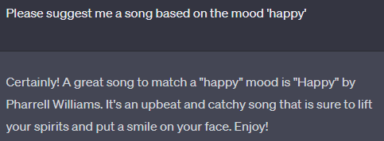

I have heard this song before, so I would like to ask for more information about this song.

`Please tell me more about this song. I want to appreciate this song`

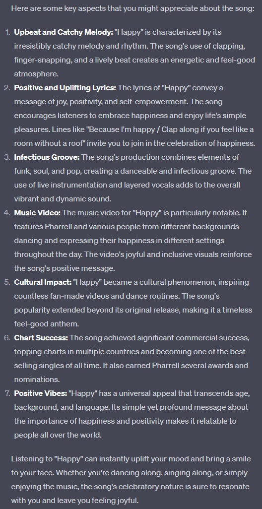

Here we got some great information about what makes this song so uplifting. Let's ask for a similar songs.

`Please suggest me a song similar to this song`

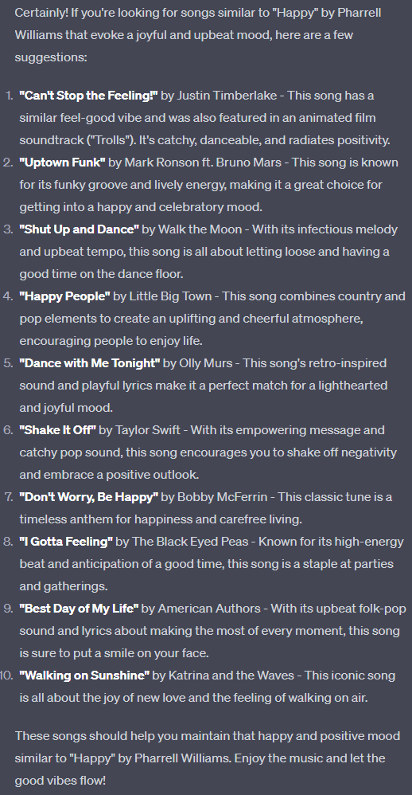

Here is an even better idea, let's ask for a playlist of similar songs to include for a kids birthday party.

`Suggest me a playlist with similar songs for a kids birthday party.  Do not include songs with explicit lyrics`

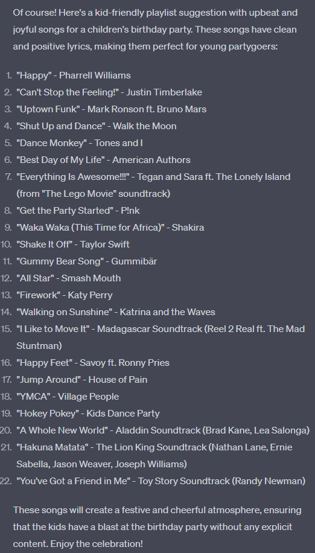

We now have a great playlist that we can play and adjust to our liking. While there are other ways to find music, ChatGPT can serve as a great tool to find and learn about music.

I encourage you to open a new conversation and find a music style that you like and explore it with ChatGPT. I've used ChatGPT for interpreting lyrics, finding new music, creating playlist, and learning about music.

### Journaling

Journaling is an effective personal development practice.

- It helps you clear your mind.
- You can see patterns in your thoughts.
- You remember important life events.
- It helps you make sense of things.
- It reminds you of good feelings and goals for the future.

Keeping a journal has its challenges.

- It's hard to start writing sometimes.
- Looking at a blank page can be tough.
- You might wonder if writing about your day is useful.

After a while:

- It can feel repetitive.
- You don’t always look back at what you wrote.
- Questions like "What are you grateful for?" can get boring.

What journaling with ChatGPT can do for you:

- A mix of journaling and conversation.
- Writing feels new and exciting each time.
- It can help see things in a new way.

#### Free Writing

Let's experience the freedom of expression through guided writing exercises facilitated by ChatGPT. Free writing encourages individuals to write without the limitations of grammar, structure, or judgment.

**Objectives**

- Utilize ChatGPT to generate creative writing prompts.
- Engage in free writing without constraints.

**Activities**

- Prompted Writing: Use ChatGPT to generate prompts and spend time writing your thoughts and ideas freely.

The power of ChatGPT lies in its ability to create unique and stimulating writing prompts tailored to individual preferences and needs.

Let's begin by asking ChatGPT to provide us with a writing prompt that encourages us to reflect on our life.

`provide me with a writing prompt that encourages self-reflection on personal growth and self-improvement
`

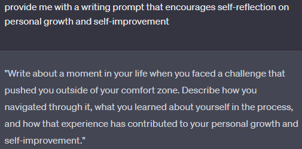

I'm not really feeling that writing prompt, so I'll click the regenerate button until I get a prompt that I like.

After 2 regenerations, I got a prompt that I like.

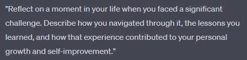

Wow! I wrote a lot with this prompt and it actually helped me reflect and remember something I had forgotten. I encourage you to try this exercise and see what you can discover about yourself.

Remember, this is free writing, so don't worry about grammar or structure. Just write what comes to mind. You can always edit it later.

I also want to emphasize that you can use ChatGPT to generate prompts for any topic, writing poetry, short stories, and even essays. You'll know you're free writing when your writing feels free and flowy.

Next, we will explore a more structured approach to journaling.

#### Gratitude Journal

Gratitude journaling is a rewarding daily practice with many proven benefits. By focusing on what we appreciate, it fosters positive emotions, reduces stress, and promotes overall well-being. In this section, we'll explore how to use ChatGPT as your personal gratitude journaling assistant, making the process more engaging, insightful, and personalized.

Whether you're new to this practice or seeking to deepen your existing gratitude journey, this workshop offers engaging insights and hands-on guidance.

**Objectives**

- Introduce the practice of gratitude journaling.
- Learn how to use ChatGPT to guide and enhance your gratitude journaling practice.
- Encourage consistent practice as a way to improve well-being and contentment.

###### Personalization with ChatGPT

Every person's gratitude journey is unique. From simple daily affirmations to in-depth reflections, you can explore different gratitude practices. ChatGPT can help you find one that resonates with you.

For starters, we can ask

`What are different ways to practice gratitude?`

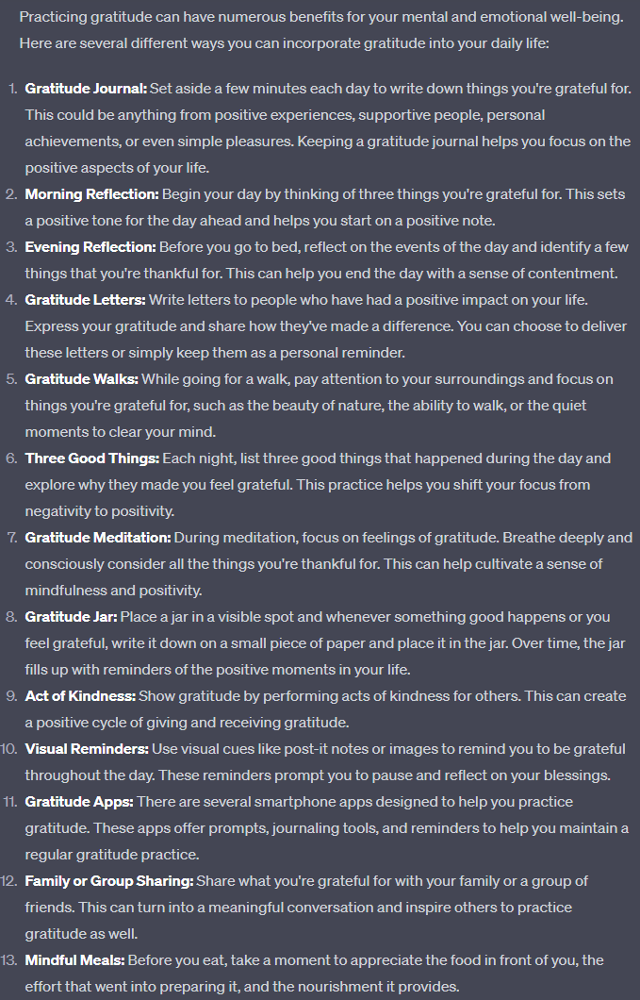

Did any of these resonate with you? Since, we are on a Journaling section, let's go ahead and ask ChatGPT to some examples of gratitude journal entries.

`Can you give me examples of gratitude journal entries?`

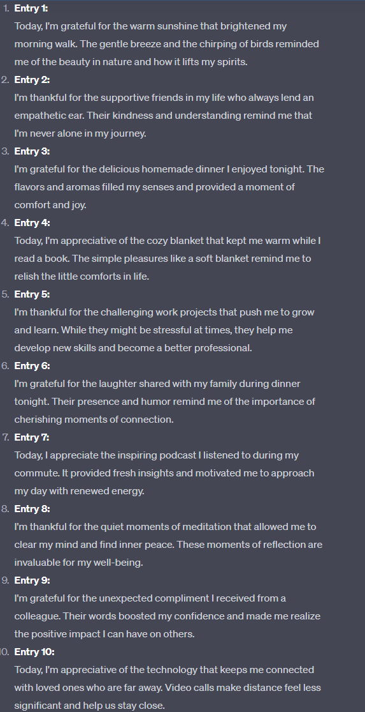

These entries can serve as inspiration for your own gratitude journaling practice.

**Activities**

#### Generating Prompts

Wondering where to begin? Start your gratitude journaling by asking ChatGPT to provide you with prompts. Try asking:

- "Can you give me a gratitude prompt for today?"
- "What should I be thankful for right now?"
- "Be me weekly gratitude prompt generator."
- "Suggest a gratitude prompt about friendship."
- "What is a good prompt for being thankful about challenges?"

It might be worth providing some context about yourself, such as age, location, roles (parent, student, sister, boss, etc), situtation, and beliefs so the prompts are more personalized.

#### Reflective Guidance

As you write, you can use ChatGPT to deepen your reflection. Ask follow-up questions related to your gratitude entries, and let ChatGPT guide you in understanding why these aspects of life are meaningful to you such as:

- "How can I explore this gratitude entry further?"
- "Summarize my gratitude entry in one sentence."
- "Is there something I overlooked in this entry?"
- "What positive impact did this experience have on my life?"
- "Why is being thankful for small things important?"
- "Expand my entry into a short story. Ask me questions to write about it."
- "Help me turn my entry into a letter of appreciation."
- "What can I learn from this entry I wrote about?"

#### Reframing Negative Thoughts

Sometimes we might find it hard to be grateful. ChatGPT can help us reframe negative thoughts into positive ones.
When focused on complaints, ask ChatGPT to rephrase them into gratitude statements. For example:

- "I'm so stressed about this work project. Can you reframe this positively?"
- "I'm angry at my friend for not calling me back. Can you help me reframe this?"
- "I feel lost, confused, and overwhelmed. Can you help me reframe this?"
- "I hurt my ankle and can't go for a run. Can you help me reframe this?"
- "Here is a list of things I'm worried about. Can you help me reframe these?"

ChatGPT can provide a thoughtful perspective to practice appreciation, not frustration.

#### Summarizing Key Insights

ChatGPT can also summarize and pull out key themes from your entries. Ask it to read your recent posts and highlight the main things you're grateful for. This distills your big picture insights so you can reflect on patterns over time.

##### Reviewing Gratitude Entries with ChatGPT

Regularly reviewing your gratitude entries with ChatGPT provides valuable self-reflection and can be an enlightening experience. Ask it to identify patterns and insights, enhancing your understanding of their positive impacts on your life.

#### Community and Connection

Gratitude isn't just for you. It helps us connect with others. While this workshop shows you how to use ChatGPT for yourself, remember that you can also use it to say thank you to others. Whether it's your family, friends, or even someone you just met, a simple thank you can make a big difference.

### Conclusion

Using ChatGPT makes writing about things you're thankful for fun and easy. It can even help reframe and rewrite something negative into something positive. With its help, you can write about good things in your life every day. Over time, you'll not only foster a more appreciative outlook, but you'll also cultivate a richer understanding of yourself.

#### Additional Resources

- **Gratitude Journal Templates**: Utilize customizable templates designed to suit various journaling preferences.
- **Further Reading**: Explore articles, research, and books on the science of gratitude and its impact on well-being.

<!-- ## Learning

### Education

### Interview

## Ideation

Unlike a human, ChatGPT doesn't get tired or

### Brainstorming

### Start a Business -->

## 4. Hallucinations, Math, Policies, Bias, and Economic Impacts

### An important sidenote about responses

ChatGPT might not always give the same answer to the same question. It's based on statistics, so its answers might vary. Remember, it's using information up to September 2021, so it's good to double-check the answers.
You can "Trust, but verify" the responses.

### AI Hallucinations

What is AI hallucination? It is when the AI generates an answer that seems right., but it is wrong. This can be dangerous for users who rely on ChatGPT. You have to double-check and keep a critical eye on the response.

> If you find an answer is unrelated, please provide that feedback by using the "Thumbs Down" button.

### Mathematical Capabilities

ChatGPT doesn't perform calculations like a traditional calculator, but it can give a close estimation with a language approach only. That's because its training data included a lot of math text. If you plan to use ChatGPT for math problems, include `Let's think step by step` in your prompt. This allows it to provide itself context and give you a more accurate response.

### Privacy

ChatGPT is not designed to handle sensitive or personal information. While conversations aren't stored long-term, the data can temporarily be used to refine and improve the model.. If you want to keep your conversation private, you can use the "Private Conversation" feature available only to ChatGPT Plus users.

### Usage Policy

[https://openai.com/policies/usage-policies](https://openai.com/policies/usage-policies)

### Commercial Use

Subject to the [Content Policy](https://labs.openai.com/policies/content-policy) and [Terms](https://openai.com/api/policies/terms/), you own the output you create with ChatGPT, including the right to reprint, sell, and merchandise – regardless of whether output was generated through a free or paid plan.

### Bias & Discrimination

ChatGPT is not inherently biased, but the data it was trained on may contain biases that could be reflected in its responses. For example, ChatGPT has produced outputs that are nonsensical, factually incorrect, or even sexist, racist, or otherwise offensive. Careful research is always in order. One should never rely solely on ChatGPT when making important decisions. You can try asking for counterfactual examples to better understand a situation or answer.

### Economic Impacts

- The global artificial intelligence (AI) market was worth $454.12 billion in 2022 and is expected to reach $2,575.16 billion by 2032.
- Some predict that AI could contribute up to $15.7 trillion to the global economy in 2030. This is more than the current output of China and India combined.
- Others predict that AI could increase global GDP by 14% in 2030.
- The AI market is growing and predicted to be worth trillions. It could boost the global economy but also disrupt jobs and society. It's exciting but complex, and the actual impact is still uncertain.

[PwC’s Global Artificial Intelligence Study: Exploiting the AI Revolution](https://www.pwc.com/gx/en/issues/data-and-analytics/publications/artificial-intelligence-study.html#:~:text=AI%20could%20contribute%20up%20to%20$15.7%20trillion1,current%20output%20of%20China%20and%20India%20combined.)

[Economic impacts of artificial intelligence (AI)](<https://www.europarl.europa.eu/RegData/etudes/BRIE/2019/637967/EPRS_BRI(2019)637967_EN.pdf#:~:text=AI%20is%20seen%20by%20many%20as%20an%20engine%20of%20productivity%20and%20economic%20growth.&text=However%2C%20AI%20may%20also%20have%20a%20highly%20disruptive%20effect%20on%20the%20economy%20and%20society.>)

[The impact of artificial intelligence on growth and employment](<https://cepr.org/voxeu/columns/impact-artificial-intelligence-growth-and-employment#:~:text=The%20McKinsey%20Global%20Institute%20predicts,in%202030%20(PwC%202017).>)

[Artificial intelligence (AI) market size worldwide in 2021 with a forecast until 2030](https://www.statista.com/statistics/1365145/artificial-intelligence-market-size/#:~:text=According%20to%20Next%20Move%20Strategy,a%20vast%20number%20of%20industries.)

It's still hard to predict whether more jobs will be created than lost. But it's important to be aware of the potential impact of AI on the economy and society.

### Future Updates

OpenAI the company behind this successful application is constantly coming out with improvements guide by safety and improved user experience. Their goal is to align AI with human interests. When ChatGPT was newly released, many people found ways to "jailbreak" it. This means they found ways to make it do things it was not designed to do. For example, malicious users were able to make it generate racist, sexist, and other offensive text. OpenAI has since improved the model to prevent this from happening and it will continue in the future. Given the increasing focus on AI safety worldwide, governments and tech companies are intensifying their collaboration efforts. GPT-5 is anticipated to be released in 2024.

Here are the [Release Notes](https://help.openai.com/en/articles/6825453-chatgpt-release-notes) for ChatGPT.

### Quiz 3 - Limitations, Ethics, Economy & Future Updates

1. **Does ChatGPT provide the same answer to the same question?**

- a) True.
- b) False.

2. **What is AI hallucination?**

- a) A new type of technology.
- b) When ChatGPT dreams.
- c) When ChatGPT gives a wrong answer thinking it's right.
- d) When ChatGPT refuses to answer.

3. **How does ChatGPT handle mathematical problems?**

- a) Yes, with exact calculations.
- b) No, it can't do any math.
- c) Yes, by using a language approach.
- d) No, only algebra.

4. **How should you approach using ChatGPT with sensitive information?**

- a) It doesn't like personal questions.
- b) It can use your information to train the model.
- c) It will tell everyone your secrets.
- d) It asks for a password.

5. **What is the projected impact of AI on the global economy?**

- a) It will cause a global recession.
- b) It will decrease GDP by 14%.
- c) It could contribute trillions and increase global GDP.
- d) It will have no effect.

### Answers

1. b
2. c
3. c
4. b
5. c

## 5. Conclusion & Call to Action

### Final Conclusion

You've reached the end of this guide on how to use ChatGPT to improve your life and help others. ChatGPT is not a replacement for search engines like Google or Bing. It's quite different, because in a sense, it's fresh text. The text generated is likely new to the world. I encourage you to go ahead and test the limits of ChatGPT. It's a great way to explore what it's capable of.

### Key Takeaways

- Engaging with ChatGPT: Its user-friendly interface, built on advanced AI models, offers an experience akin to texting a friend. Yet, its potential extends far beyond casual conversation.

- Prompts and Responses: The essence of a great interaction with ChatGPT is rooted in effective prompting. The more detailed and concise your prompts are, the richer and more insightful your responses will be.

- Beyond Basic Communication: As explored in our interactive workshop, the possibilities are vast – from journaling and creative ideation to learning new subjects.

- Considerations for the Future: Like any technology, ChatGPT has its limitations. As users, it's crucial to be aware of issues like hallucinations, biases, and privacy concerns. Yet, the future looks promising with continuous updates and refinements on the horizon.

#### Tips

- Quality in, quality out. Prompt with rich, detailed instructions, and you'll be rewarded with a great response.
- If you're not happy with the response you get, try rephrasing your prompt or adding more context.
- Keeps your prompts focused and relevant to maintain a coherent conversation.
- ChatGTP can help you generate context by asking you questions, and it can also provide context with its responses.
- ChatGPT can offers many [response formats and styles](###response-format-or-styles).

## **Improve your life**

**ChatGPT** is a transformative tool designed to enhance various aspects of your life. Here's how:

### **1. Education & Tutoring** 📚

- Explain complex concepts
- Homework solution breakdown
- Study strategies and resources
- Personalized test prep
- Clarify doubts on-the-go

### **2. Research & Information Gathering** 🔍

- Statistics and data
- Scientific facts
- Curate reading lists
- Fact-checking

### **3. Language Learning** 🗣️

- Interactive vocabulary quizzes
- Customized grammar exercises
- Accent reduction tips
- Cultural context insights
- Translation assistance

### **4. Writing Assistance** ✍️

- Proofreading
- Suggestions for effective phrasing
- Tone adaptation for target audience
- Drafting outlines
- Categories and tags suggestions

### **5. Mental Health** 🧠

- Mindfulness exercises
- Stress relief techniques
- Self-care reminders
- Relaxation prompts

### **6. Coding & Technical Help** 👩‍💻

- Optimize code performance
- Understand new programming languages
- Code snippet suggestions
- Best practice recommendations
- Test and debug code

### **7. Ideation & Creativity** 💡

- Story prompts
- Content curation for inspiration
- Overcome creative blocks
- Diverse perspective insights
- Brainstorming exercises

### **8. Business & Entrepreneurship** 💲

- Startup funding avenues
- Competitive analysis
- Customer behavior insights
- Branding tips
- Marketing strategies
- SWOT analysis

### **9. Strategy & Planning** 📈

- Long-term vision exercises
- Risk assessment
- Goal setting and tracking
- Resource allocation insights
- Career planning
- Project management

### **10. Accessibility** 🦾

- Tools for differently-abled individuals
- Customizable UI/UX suggestions
- Assisting with creating accessible content
- Enhancing communication with others

### **11. Entertainment** 🎮

- Curate personalized playlists
- Recommend movies/shows
- Interactive story generation
- Play games
- Roleplay scenarios

### **12. Cooking & Recipes** 🍳

- Dietary restrictions adjustments
- Cooking technique
- Pairing recommendations
- Ingredient substitutes
- Recipe suggestions
- Meal Prep

### **13. Travel & Exploration** 🌎

- Local customs and etiquettes
- Off-the-beaten-path destinations
- Safety tips and recommendations
- Budgeting and saving tricks

### **14. Job Search & Interviewing** 💼

- Network building strategies
- Personal brand building
- Resume and cover letter
- Interview preparation
- Salary negotiation tips
- Follow-up etiquette and templates

### **15. Art** 🎨

- Art History
- DIY craft ideas
- Art recommendations
- Tips for artists
- Art tools and resources

### **16. Journaling & Reflection** 📖

- Daily affirmation prompts
- Diary entries
- Gratitude Journaling
- Self-reflection exercises

### **17. Event Planning** 🎉

- Theme suggestions
- Guest list management
- Event planning checklist
- Date night ideas
- Party games

### **18. Shopping** 🛍️

- Pros and cons of products
- Product recommendations
- Price comparison
- Gift ideas

### **19. Fitness & Health** 🏋️

- Personalized workout plans
- Diet and nutrition guidance
- Tracking physical progress
- Meditation and relaxation techniques
- Rehabilitation exercises

### **20. Home & Interior Design** 🏠

- Design style quizzes
- Room layout ideas
- Sustainable and eco-friendly options
- DIY home improvement projects
- Furniture and decor recommendations

### **21. Parenting & Family** 👨‍👩‍👧‍👦

- Child development insights
- Activities for family bonding
- Strategies for challenging behaviors
- Educational game suggestions
- Pet care tips

### **22. Personal Finance & Investing** 💰

- Budgeting tools and tips
- Investment strategies for beginners
- Retirement planning
- Debt management advice

### **23. Gardening & Landscaping** 🌱

- Plant care guides
- Garden layout designs
- Sustainable gardening tips
- Pest control methods
- Seasonal planting calendar

### **24. Personal Development** 🧑

- Book recommendations
- Skill acquisition resources
- Time management hacks
- Public speaking tips
- Book summaries

### **25. Hobbies & Crafts** 🧵

- DIY project ideas
- Introduction to new hobbies
- Resources for craft supplies
- Tips and tricks for various crafts
- Community and forum recommendations

### **26. Digital Literacy & Cybersecurity** 🖥️

- Basics of digital tools
- Safe browsing practices
- Protecting personal information online
- Recognizing cyber threats
- Understand Terms of Service and Privacy Policies

### Call to Action

ChatGPT is the general public's first hands-on introduction to how powerful modern AI has gotten. It's more than just a tool; it's an opportunity to grow, innovate, and connect in ways previously unimagined. From aiding in personal development to fostering community projects, the possibilities are boundless because it engages with you, offering tailored responses, fresh perspectives, and inspiration. Thank you for learning about ChatGPT and how it can improve your life. I encourage you to share it with others and help them improve their lives with ChatGPT.
