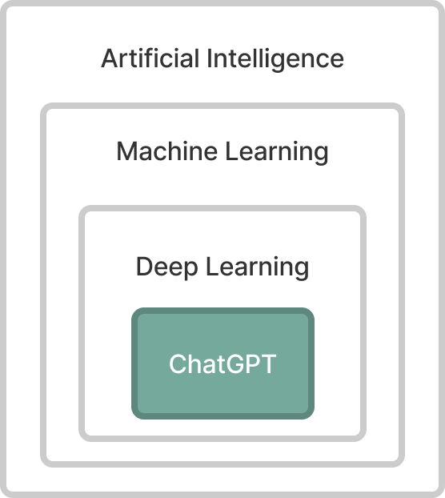

# Improve Your Life With ChatGPT: A User-Friendly Guide

Welcome to "Improve Your Life With ChatGPT". In this course, you'll discover how to harness the power of ChatGPT not only to enhance your own life but also to inspire and benefit others.

This course is tailored for beginners, especially non-technical adults with a fundamental grasp of computers and basic internet skills.

The course is broken down into 5 sections.

<!-- Each section has a short video and a short quiz. *Future update* -->

# Table of Contents

1. [Introduction](#introduction)
   - What is ChatGPT, What does it do, & Getting Started.
2. [How To Use ChatGPT](#how-to-use-chatgpt)
   - Prompts, Context, Advance Prompting, Formats & Styles
3. [Interactive Workshop](#interactive-workshop)
   - Creative art, DIY, Journaling, Learning, Ideation
4. [Limitations, Ethics, & Future Updates](#limitations-ethics--future-updates)
   - Hallucinations, Privacy, Usage Policy, Bias & Discrimination, Jobs & Economy, ChatGPT Evolves
5. [Conclusion & Call to Action](#conclusion--call-to-action)
   - Tips, Resources, Improve your life & other people's lives

## Before We Begin

- Create a free account on [chat.openai.com](https://chat.openai.com/) to start using ChatGPT.

- For on-the-go access to ChatGPT, consider downloading the app for iOS or Android.

# Introduction

Imagine arranging a dinner date with a friend. You send a quick text, and they promptly reply with a proposed time. A few exchanged emojis later, your evening plans are set.

In an age where digital communication feels almost as natural as face-to-face conversation, we are continually seeking ways to make our interactions with technology more intuitive and efficient.

## What is ChatGPT?

ChatGPT is a step towards humans communicating with computers as they would with other humans. So, how does it achieve this?

You could technically 'speak' to ChatGPT. However, for it to work, your spoken words must be transformed into text. That's because ChatGPT is an AI chat application built on an advanced AI model known as the "Generative Pre-trained Transformer" or GPT. ChatGPT is a shining example of Large Language Models (LLMs). These LLMs undergo training on vast troves of text data, ranging from books to internet content, including extensive resources like Wikipedia. This immense data training enables them to identify and understand the intricate patterns within human language. Specifically, it thrives in the realm of NLP (Natural Language Processing), aiming to grasp and reproduce the intricacies of natural human language.

NLP encompasses a broad range of tasks:

**Text Classification** - Categorizing input text into predefined groups such as sentiment analysis and topic categorization.

**Automatic Translation** - Translating text from one language to another without human intervention.

**Question Answering** - Providing answers based on a given text.

**Text Generation** - Generating coherent and relevant output text from a given input, known as a prompt.

At its core, ChatGPT is a prediction engine, crafting responses based on the myriad patterns it has observed in its vast training data.

To grasp ChatGPT's capabilities, we first need to define some foundational concepts:

### Artificial Intelligence (AI)

Any technique that enables computers to mimic human behavior.

### Machine Learning (ML)

A subset of Artificial Intelligence that focuses on developing algorithms and statistical
models to enable computers to learn from and make predictions or decisions based
on data without explicit programming.

### Deep Learning (DL)

A subset of Machine Learning that uses neural networks to learn from and make predictions or decisions based on data without explicit programming.

### Neural Networks (NN)

A neural network is a computer program inspired by the way our brain works. It learns from data, much like how we learn from experience. Given enough data and training, it can make predictions or recognize patterns.

Now that you have an overview of what ChatGPT is, let's explore how to get started with it.

## Getting Started

You can access ChatGPT for free at [chat.openai.com](https://chat.openai.com/).

- An account is required.
- Usage is throttled.
- Conversations are not private by default.

For enhanced features, ChatGPT Plus is available at $20/month:

- Priority access.
- Increased usage limits.
- Private conversations.
- Access to new features.
- Availability of GPT-4.

### ChatGPT Versions

**ChatGPT-4** - is OpenAI’s most advanced system, producing safer and more useful responses. It can solve difficult problems with greater accuracy, thanks to its broader general knowledge and problem-solving abilities. Exclusively only available to ChatGPT Plus users.

**ChatGPT-3.5** - is a chatbot that was launched by OpenAI and is built on top of the GPT-3.5 family of large language models and is fine-tuned with supervised and reinforcement learning techniques. It can answer everyday questions, admit wrong replies, and reject inappropriate requests. Available to all users.

# How To Use ChatGPT

At its core, ChatGPT is designed to be a user-friendly assistant. For general use, you simply engage in a conversation with it, much like texting a friend. You can ask a question or present a topic and it will respond.

> "Never include sensitive personal, business, or customer data in your conversations with ChatGPT."

## Let's get started with a prompt!

A prompt is the text you enter into the text box to start a conversation with ChatGPT. Writing a good prompt helps us get the most out of AI tools like ChatGPT. Prompting is a way to give these AI models direction so it can understand our task and then help us complete it. But to get the best results, you need to know how to craft a good prompt. And most people who struggle with prompting are making the same mistake. They're being too generic and expecting that AI is just going to read our minds.

### Example 1 - Simple Prompt

Let's begin with a simple prompt asking for life advice. "I want to improve my life"

As you can see in this response ChatGPT is a friendly assistant that gives general tips to improve your life. It's not perfect, but it's a good start. Let's try another prompt with a little more context.

### Example 2 - More Context

Let's try a prompt that gives ChatGPT more context. "I want to improve my life by being more productive"

As we can see, with more context, ChatGPT has more information about the situation, allowing it to respond more specifically to our request. Sometimes we are not sure exactly what we want to ask ChatGPT. In these cases, we can ask ChatGPT to help us.

### Example 3 - Ask me for context

Let's try a prompt that asks ChatGPT for help by having ChatGPT ask questions. "I want to improve my life by being more productive. Can you ask me questions about the context?"

Instead of asking it to do the task, we now instruct the ChatGPT to ask questions about the context. If we answer them, it must help it to do better completions.

## Advanced Prompting

All three examples show you how context is important to ChatGPT. The more context you give it, the better it can respond to your request. Those are sure to get you started, but let's look at some more advanced prompting techniques. These techniques will transform your ChatGPT experience.

### Prompt Length & Asking for Multiple Things

Now that you're getting better responses, you might be tempted to write a long prompt, asking for 4 or 5 things at once. But this is usually not a good idea, especially if you're using GPT-3.5. ChatGPT works best when you give it one specific thing to focus on at a time, this specific thing can be complex but be sure to stay away from giving it a list of to-dos. It's better to involve an incremental process to get your desired result. GPT-4 on the other hand, can handle longer prompts that request multiple things.

### Conversation Length

Another important thing to know is that each conversation has a maximum "context" length. If you have a long conversation, ChatGPT will always try to use everything in the conversation to generate a response, but if you keep going after its limit, you can keep chatting but the responses will be less and less relevant to the original conversation. This is why it's important to keep your prompts and conversations more focused.

As of July 2023:

- GPT-3.5-Turbo has a maximum context length of 4k tokens, which is roughly 3,000 English words.
- GPT-4 has a maximum context length of 8k tokens, which is roughly 6,000 English words.

### Response Format or Style

Here are some formats or styles you can use to get different types of responses from ChatGPT suited to your needs:

- Direct answer
- List or bullet points
- Dialogue or FAQ
- Essay or article
- Story or poem
- Table or spreadsheet
- Narrative or storytelling
- Code or script
- Analogies or metaphors
- Analysis or commentary
- Quiz or Multiple Choice
- Interview or Q&A
- Chronological or timeline
- Pros and Cons
- Recommendations or suggestions
- Roleplay or Scenario
- Markdown or HTML
- Journal or Diary
- Recipe or Instructions
- Step by Step

Could you think of other formats or styles?

Remember, ChatGPT is tailored to be a user-friendly assistant, but sometimes, you might want to guide it a bit so it understands you better. That's where "One-Shot" and "Few-Shot Learning" come in. Let's simplify these terms.

## One-Shot and Few-Shot Learning

One-shot or Few-shot learning is a technique wherein you provide one or more examples (or "shots") in your prompt to guide ChatGPT's responses. By showing ChatGPT example inputs and outputs for a particular task, you are essentially teaching it how to perform that task in a specific format or structure. The idea is to leverage these examples to steer the AI towards more tailored outputs.

For instance, in this one-shot example, we want ChatGPT to give us a name that matches a color we provide.

In this scenario, ChatGPT learned that we want names that match a color given. One-shot helps tailor the response to our needs. My blue cat now has a name. Azure!

### Advantages of Few-shot Learning

1. **Tailored Responses**: By giving ChatGPT explicit examples, you can guide its answers to fit a particular structure or style. This ensures you get responses that align more closely with your expectations.
2. **In-context Learning**: The examples serve as conditioning, enhancing the performance of the model in the context of the ongoing conversation. By setting the stage with a few examples, you instruct ChatGPT on the kind of outputs you desire.

> Remember, each time you start a new thread or session, these examples should be reintroduced, as ChatGPT retains memory solely within the current context or conversation.

In conclusion, Few-shot prompting with ChatGPT is a potent tool, especially when seeking more refined, structured, or specialized responses. Whether you use one example or a few, you're helping it understand you better. And that makes your chat even more fun and helpful!

# Interactive Workshop

WIP

# Limitations, Ethics, & Future Updates

### An important sidenote about responses

ChatGPT by default is not supposed to have deterministic responses. This means that asking the same question twice will likely not result in the same response. This is because ChatGPT is a statistical model. Its responses are "limited" by the data it was trained on, which stopped in September 2021. You can "Trust, but verify" the responses.

### Beware of AI Hallucinations

What is AI hallucination? It is when the AI thinks something is right, but it is wrong. This can be dangerous for users who rely on ChatGPT. You have to double-check and keep a critical eye on the response.

### ChatGPT & Math

ChatGPT has no mathematical capabilities, but it can give a close estimation with a language approach only. That's because its training data included a lot of math text. If you plan to use ChatGPT for math problems, include "Let's think step by step" in your prompt. This allows it to provide itself context and give you a more accurate response.

### Privacy

ChatGPT is not designed to handle sensitive information and your conversation is not private by default, the conversation history can be used to train the model and improve it. If you want to keep your conversation private, you can use the "Private Conversation" feature available only to ChatGPT Plus users.

### Usage Policy

[https://openai.com/policies/usage-policies](https://openai.com/policies/usage-policies)

### Bias and Discrimination

WIP

### Jobs and the Economy

WIP

### ChatGPT Evolves

OpenAI the company behind this successful application is constantly improving their model. Their goal is to align AI with human interests. When it was newly released, many people found ways to "jailbreak" it. This means they found ways to make it do things it was not designed to do. For example, malicious users were able to make it generate racist, sexist, and other offensive text. OpenAI has since improved the model to prevent this from happening and it will continue in the future.

# Conclusion & Call to Action

ChatGPT is not a replacement for search engines like Google or Bing. It's quite different, because this, in a sense, it's fresh text. The text generated is likely new to the world. I encourage you to go ahead and test the limits of ChatGPT. It's a great way to explore what it's capable of.

### Tips

- Quality in, quality out. Prompt with rich, detailed instructions, and you'll be rewarded with a great response.
- If you're not happy with the response you get, try rephrasing your prompt or adding more context.
- Keeps your prompts focused and relevant to maintain a coherent conversation.
- ChatGTP can help you generate context by asking you questions, and it can also provide context with its responses.

### Resources

WIP

## Improve your life

ChatGPT is a great tool to improve your life. It can help you with:

WIP

## Improve other people's lives

WIP
